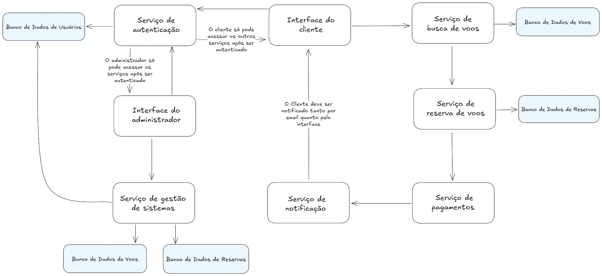

# Documentação da Arquitetura SOA do Sistema de Reservas de Voos

## Visão Geral da Arquitetura

&emsp; Este documento descreve a arquitetura Service-Oriented Architecture (SOA) proposta para o sistema de reservas de voos. A arquitetura é baseada em serviços independentes que se comunicam entre si para fornecer as funcionalidades do sistema. O objetivo principal é criar um sistema flexível, escalável e facilmente integrável com serviços externos para aprimorar a experiência do usuário e reduzir a necessidade de desenvolvimento interno extensivo.

## Arquitetura SOA

Figura X - Arquitetura SOA 

Fonte: Material produzido pelos autores (2025)

&emsp; **Observação Importante sobre os Bancos de Dados:** No diagrama, "Banco de Dados de Voos" e "Banco de Dados de Reservas" são representações separadas por uma questão estética para facilitar a visualização do fluxo de dados de diferentes serviços. **Na implementação real, é altamente provável que as informações de voos e reservas sejam armazenadas no mesmo banco de dados ou em um conjunto de bancos de dados interconectados**, dependendo da complexidade do modelo de dados e dos requisitos de desempenho.

## Descrição dos Serviços e Componentes

* **Interface do Cliente:** Representa a interface com a qual os clientes interagem (aplicação web ou mobile). Permite pesquisar voos, visualizar resultados, selecionar voos, fornecer informações pessoais e de pagamento, e receber confirmações de reserva. A interação é bidirecional pois a interface envia requisições aos serviços e recebe respostas.

* **Serviço de Pesquisa de Voos:** Responsável por receber os critérios de pesquisa do cliente, consultar o **Banco de Dados de Voos e Reservas** para encontrar voos disponíveis e retornar os resultados para a Interface do Cliente.

* **Serviço de Reserva de Voos:** Orquestra o processo de reserva. Recebe a seleção de voos do cliente, verifica a disponibilidade no **Banco de Dados de Voos e Reservas**, interage com o **Serviço de Pagamentos** para processar o pagamento e, em seguida, atualiza o status da reserva no **Banco de Dados de Voos e Reservas**.

* **Serviço de Autenticação:** Gerencia a autenticação e o registro de clientes e funcionários. Interage com o **Banco de Dados de Usuários** para verificar credenciais e armazenar informações de registro. A interação com as interfaces é bidirecional para receber as credenciais e informar o status da autenticação.

* **Interface do Administrador:** Interface utilizada pelos funcionários da companhia aérea para gerenciar o sistema, incluindo voos, disponibilidade, preços e informações de clientes. A interação é bidirecional para enviar comandos e receber informações do **Serviço de Gestão de Sistemas**.

* **Serviço de Gestão de Sistemas:** Fornece as funcionalidades para a administração do sistema. Interage com o **Banco de Dados de Voos e Reservas** para gerenciar voos e reservas, e com o **Banco de Dados de Usuários** para gerenciar informações de clientes e funcionários. A interação com a Interface do Administrador e os bancos de dados é bidirecional para permitir a leitura e a escrita de dados.

* **Serviço de Notificações:** Responsável por enviar notificações aos clientes (por e-mail e potencialmente outros canais), como confirmações de reserva, lembretes e atualizações de voo. Ele lê informações do **Banco de Dados de Voos e Reservas** para obter detalhes relevantes e informações de contato dos usuários (via **Barramento de Serviços** ou diretamente). A interação com o **Barramento de Serviços** e potencialmente outras interfaces é bidirecional para receber eventos e enviar notificações.

* **Barramento de Serviços (Implícito):** Embora não explicitamente desenhado como um componente único, representa o mecanismo de comunicação entre os serviços. As setas indicando a comunicação entre os serviços sugerem a utilização de um barramento de serviços ou uma arquitetura similar que facilita a troca de mensagens e a integração.

* **Serviço de Pagamentos:** Interage com um **Provedor de Pagamento Externo** para processar as transações de pagamento dos clientes. Após o processamento, atualiza o status do pagamento no **Banco de Dados de Voos e Reservas**.

* **Provedor de Pagamento Externo:** Um serviço de terceiros responsável por processar pagamentos de forma segura.

* **Serviço de Geolocalização (Externo):** Uma API externa utilizada pela **Interface do Cliente** para detectar a localização do usuário, facilitando a sugestão de aeroportos próximos. A seta indica o consumo deste serviço pela interface.

* **Banco de Dados de Usuários:** Armazena informações sobre os clientes e os funcionários da companhia aérea (credenciais, informações de contato, etc.).

* **Banco de Dados de Voos e Reservas:** Armazena informações sobre os voos disponíveis, horários, preços, disponibilidade de assentos e os detalhes de todas as reservas efetuadas.

## Significado das Setas

As setas no diagrama de componentes representam a **direção do fluxo de comunicação e/ou dados** entre os diferentes componentes do sistema:

* **Setas Simples (--->):** Indicam um fluxo de dados ou uma chamada de serviço em uma única direção. Por exemplo, a "Interface do Cliente" envia uma solicitação de pesquisa para o "Serviço de Pesquisa de Voos".
* **Dupla de setas simples com direções opostas** Indicam um fluxo de comunicação ou dados em ambas as direções, sugerindo uma interação de solicitação e resposta. Por exemplo, a "Interface do Cliente" envia uma solicitação ao "Serviço de Autenticação" e recebe um status de autenticação.

Esta documentação fornece uma visão geral da arquitetura SOA proposta para o sistema de reservas de voos e explica o papel de cada serviço e o significado das interações entre eles.